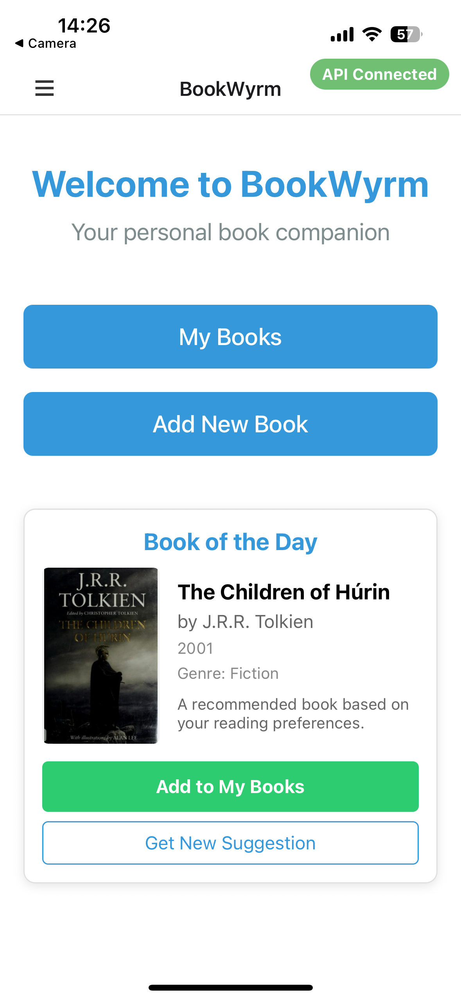
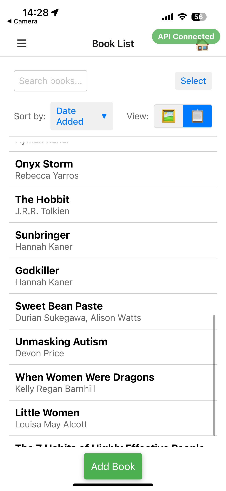
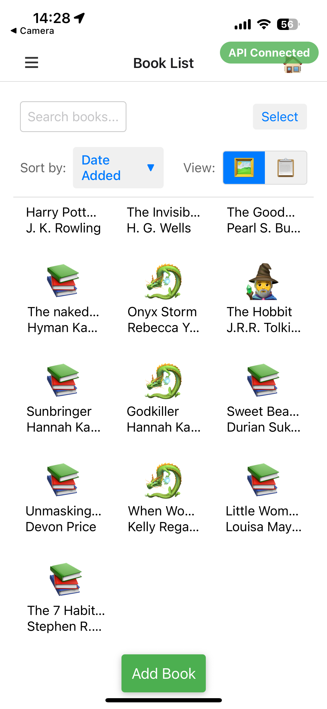
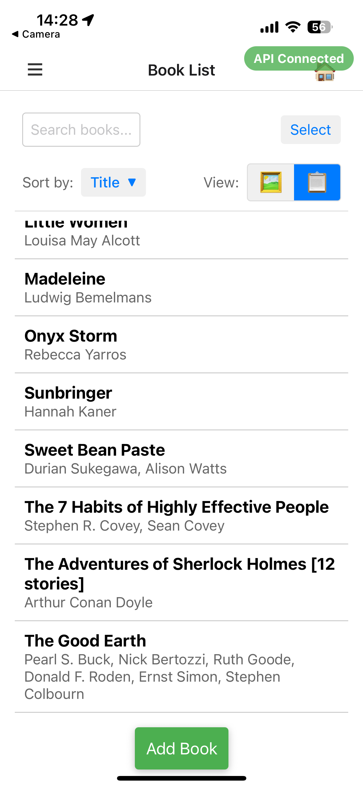
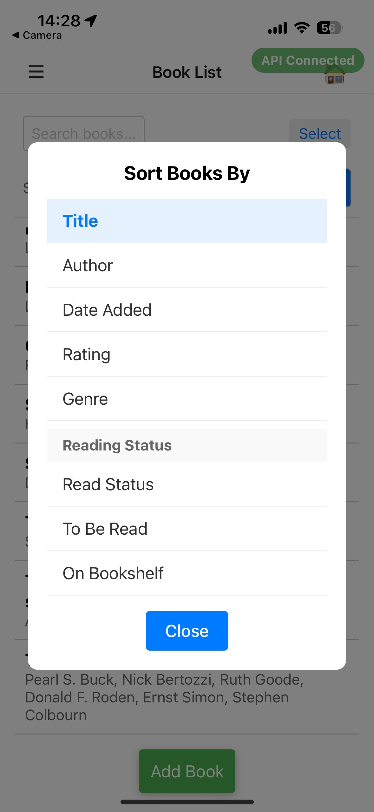
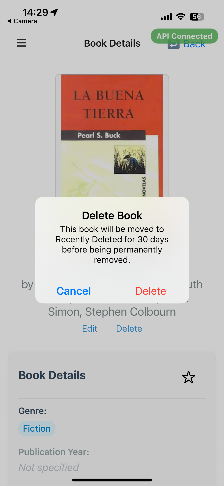
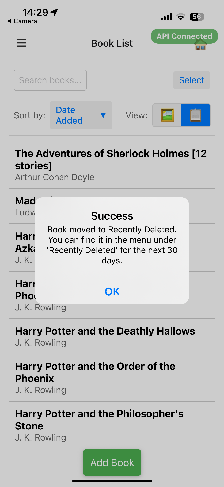
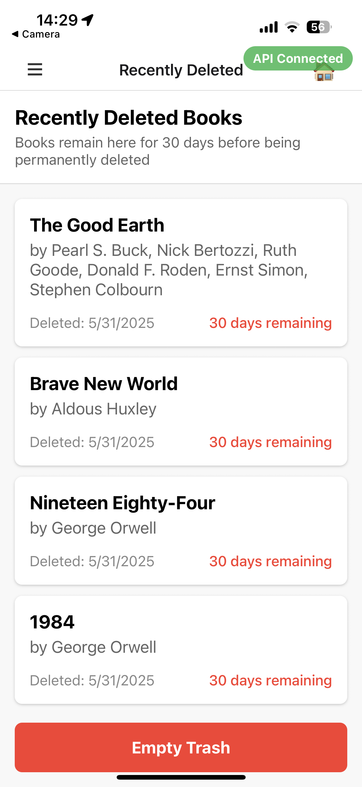
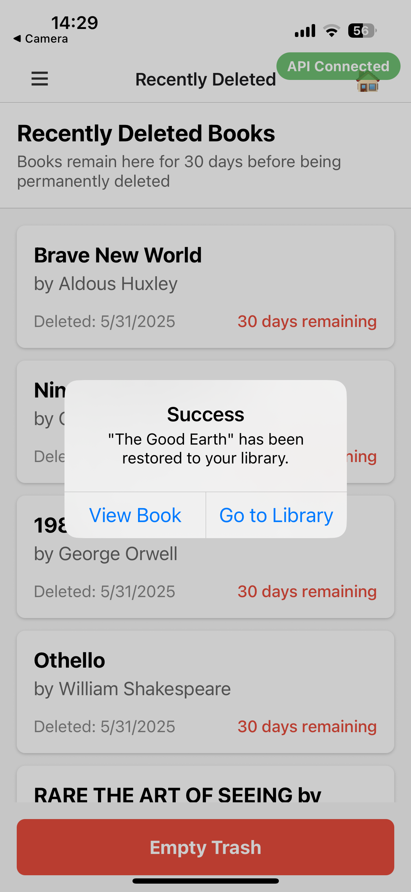
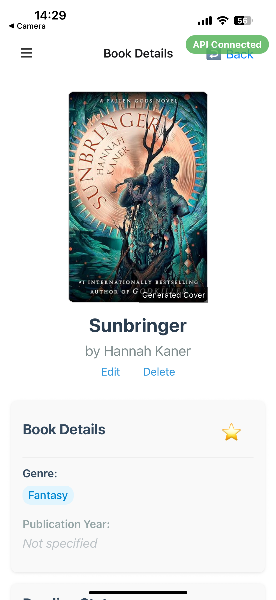

# BookWyrm <div align="right"><a href="https://linkedin.com/in/mb-in-wonderland"></a> | <a href="https://github.com/mb-owl"></a></div>

<div align="center">
<!-- TODO: Add logo once UX design is finalized
  <a href="https://github.com/mb-owl/bookwyrm">
    
  </a>
-->

  <p align="center">
    A modern book tracking and management application with a Django backend and React Native mobile frontend
    <br />
    <a href="https://github.com/mb-owl/bookwyrm"><strong>Explore the docs »</strong></a>
    <br />
    <br />
    <a href="https://github.com/mb-owl/bookwyrm">View Demo</a>
    &middot;
    <a href="https://github.com/mb-owl/bookwyrm/issues/new?labels=bug&template=bug-report---.md">Report Bug</a>
    &middot;
    <a href="https://github.com/mb-owl/bookwyrm/issues/new?labels=enhancement&template=feature-request---.md">Request Feature</a>
  </p>
</div>

<!-- TABLE OF CONTENTS -->
<details>
  <summary>Table of Contents</summary>
  <ol>
    <li>
      <a href="#about-the-project">About The Project</a>
      <ul>
        <li><a href="#built-with">Built With</a></li>
      </ul>
    </li>
    <li>
      <a href="#getting-started">Getting Started</a>
      <ul>
        <li><a href="#prerequisites">Prerequisites</a></li>
        <li><a href="#installation">Installation</a></li>
      </ul>
    </li>
    <li><a href="#usage">Usage</a></li>
    <li><a href="#roadmap">Roadmap</a></li>
    <li><a href="#contributing">Contributing</a></li>
    <li><a href="#acknowledgments">Acknowledgments</a></li>
  </ol>
</details>

<!-- ABOUT THE PROJECT -->

## About The Project

[![BookWyrm Main Screen][product-screenshot]](https://example.com)

BookWyrm is a comprehensive book management system that allows users to track their reading journey, manage their book collections, and discover new books. The application consists of a Django-powered backend for robust data management and a React Native mobile frontend for a seamless mobile experience.

### App Screenshots

<div align="center">
  
  
  
  
</div>

Key Features:

- 📚 Track your reading progress and manage your book collection
- 📱 Modern, responsive mobile interface
- 🔍 Advanced book search and discovery
- 📋 Personal book shelves and reading lists
- 📝 Notes and quotes tracking
- 📊 Reading statistics and insights

<p align="right">(<a href="#readme-top">back to top</a>)</p>

### Built With

- 
- 
- 
- 
- 

<p align="right">(<a href="#readme-top">back to top</a>)</p>

<!-- GETTING STARTED -->

## Getting Started

This is an example of how you may give instructions on setting up your project locally.
To get a local copy up and running follow these simple example steps.

### Prerequisites

- Python 3.13 or higher
- Node.js 16.0 or higher
- React Native development environment setup
- Expo CLI

### Installation

1. Clone the repository

   ```sh
   git clone <your-repo-url>
   ```

2. Set up the backend (Django)

   ```sh
   cd bookwyrm-backend
   python -m venv venv
   source venv/bin/activate  # On Windows use `venv\Scripts\activate`
   pip install -r requirements.txt
   python manage.py migrate
   python manage.py runserver
   ```

3. Set up the mobile app (React Native)

   ```sh
   cd bookwyrm-mobile
   npm install
   ```

4. Configure the environment

   ```sh
   cp .env.example .env
   # Edit .env with your configuration
   ```

5. Start the mobile app
   ```sh
   npm start
   # Or using Expo
   expo start
   ```

<p align="right">(<a href="#readme-top">back to top</a>)</p>

<!-- USAGE EXAMPLES -->

## Usage

### Running the Backend Server

```sh
cd bookwyrm-backend
source venv/bin/activate
python manage.py runserver
```

### Starting the Mobile App

```sh
cd bookwyrm-mobile
npm start
```

### Key Features

1. **Book Management**

   <div align="center">
     
     
   </div>

   - Add books to your collection
   - Track reading progress
   - Organize books into shelves

2. **Reading Tracking**

   <div align="center">
     
     
   </div>

   - Mark books as read/currently reading
   - Track reading sessions
   - Set reading goals

3. **Mobile Features**

   <div align="center">
     
     
   </div>

   - Scan book barcodes
   - Offline access to your library
   - Reading statistics and insights

_For more detailed examples and documentation, please refer to the project wiki_

<p align="right">(<a href="#readme-top">back to top</a>)</p>

<!-- ROADMAP -->

## Roadmap

- [x] Basic book management
- [x] Mobile app implementation
- [ ] Social features
  - [ ] Friend connections
  - [ ] Book recommendations
  - [ ] Reading groups
- [ ] Advanced Statistics
  - [ ] Reading pace tracking
  - [ ] Genre analysis
  - [ ] Reading habits insights
- [ ] Integration with external book APIs
  - [ ] Goodreads
  - [ ] Google Books
  - [ ] Open Library

See the [open issues](https://github.com/mb-owl/bookwyrm/issues) for a full list of proposed features (and known issues).

<p align="right">(<a href="#readme-top">back to top</a>)</p>

<!-- CONTRIBUTING -->

## Contributing

Contributions are what make the open source community such an amazing place to learn, inspire, and create. Any contributions you make are **greatly appreciated**.

If you have a suggestion that would make this better, please fork the repo and create a pull request. You can also simply open an issue with the tag "enhancement".
Don't forget to give the project a star! Thanks again!

1. Fork the Project
2. Create your Feature Branch (`git checkout -b feature/AmazingFeature`)
3. Commit your Changes (`git commit -m 'Add some AmazingFeature'`)
4. Push to the Branch (`git push origin feature/AmazingFeature`)
5. Open a Pull Request

<p align="right">(<a href="#readme-top">back to top</a>)</p>

<!-- ACKNOWLEDGMENTS -->

## Acknowledgments

- [Django](https://www.djangoproject.com/) - The web framework that powers our backend
- [React Native](https://reactnative.dev/) - For making cross-platform mobile development possible
- [Open Library](https://openlibrary.org/) - For their comprehensive book database
- DT - For loving me the most

<p align="right">(<a href="#readme-top">back to top</a>)</p>

<!-- MARKDOWN LINKS & IMAGES -->

[product-screenshot]: README_images/IMG_1453.PNG
